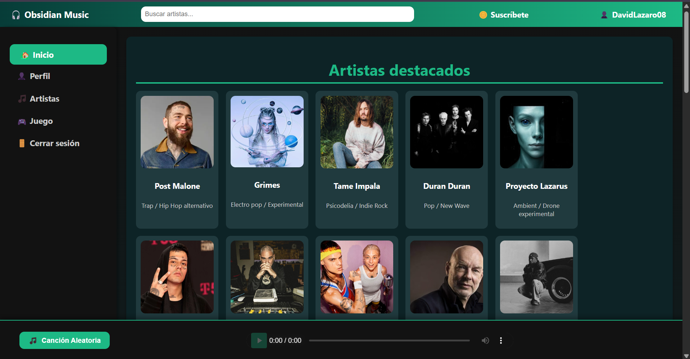

# 🎧 Proyecto Web Musical - Obsidian

Repositorio del grupo **Obsidian** formado por: 
**Juan Jiménez Nieto**, 
**Ángel Luis Matador Posada**
**Jacobo Luis Domínguez Morales**, y
**David Gutiérrez Ortiz**. 

## 📝 Descripción

Este proyecto consiste en el desarrollo de una página web musical con una estética y funcionalidades inspiradas en plataformas como Spotify. Ha sido realizado como trabajo grupal usando las tecnologías vistas durante el curso: **HTML**, **CSS** y **JavaScript**.

La web está estructurada en distintas secciones navegables, simulando un entorno musical completo y visualmente atractivo. A lo largo del desarrollo se han incorporado componentes como tarjetas interactivas, navegación dinámica, simulación de login y perfil de usuario, así como un juego básico dentro del entorno web.

## 🧩 Funcionalidades principales

- ✅ Página de **Inicio** con artistas destacados  
- ✅ Sistema de **login** y **registro**  
- ✅ Vista de **perfil de usuario**  
- ✅ Página de **artistas**, con listado e información individual  
- ✅ Sección de **juego interactivo**  
- ✅ Botón de **reproducción aleatoria** con música y publicidad ficticia.
- ✅ Estilos personalizados con gradientes, transiciones y diseño responsive  
- ✅ Navegación lateral y cambio de vistas sin recargar  

## 📁 Estructura del proyecto

```
PROYECTOWEB_OBSIDIAN/
├── .idea/                     # Configuración del entorno utilizado
├── assets/                    # Imágenes y recursos multimedia
├── css/
│   ├── artista.css
│   ├── auth.css
│   ├── perfil.css
│   ├── style.css
│   └── suscripcion.css
├── js/
│   ├── artista.js
│   ├── auth.js
│   ├── game.js
│   ├── listartistas.js
│   ├── main.js
│   ├── perfil.js
│   ├── suscripcion.js
│   └── transicion.js
├── documentación/             # Recursos usados en la presentación en clase
├── artista.html
├── game.html
├── index.html
├── login.html
├── perfil.html
└── README.md
```

## 🖼️ Captura de pantalla

Vista principal de la página de inicio (sección de artistas destacados):



## 📣 Presentación y entrega

- 📅 El proyecto fue **presentado en clase** el **viernes 25**, comentando el estado actual de desarrollo y las principales dificultades encontradas.
- 🧑‍🏫 Evaluación realizada **mediante observación directa** del docente.
- 📎 Entrega finalizada a través de **enlace al repositorio GitHub**.

---

### Gracias por visitar nuestro repositorio 😊
